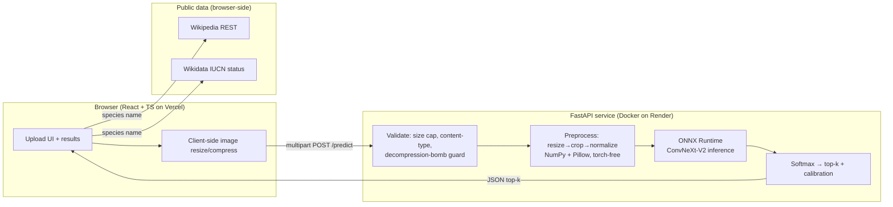

# Bird Identifier — Fine-Grained Species Classification, End-to-End

**A production-style machine-learning system that identifies 555 North American bird
species from a single photo — spanning the full lifecycle from raw data to a live,
publicly deployed web app.**

- **Live demo:** <https://bird-identifier-zeta.vercel.app/>
- **Source:** <https://github.com/joshuacortes195/Bird-Identifier>
- **Model:** ConvNeXt-V2-Base fine-tuned on NABirds · **89.0% top-1 / 98.8% top-5**
- **Stack:** PyTorch · timm · ONNX Runtime · FastAPI · React/TypeScript · Docker · Render · Vercel

---

## 1. Executive summary

This project is a complete, single-author machine-learning product. It is not a notebook
demo: it covers **data acquisition, exploratory analysis, a reproducible training pipeline,
fine-grained modeling techniques, rigorous evaluation, model interpretability, calibration,
inference optimization, a hardened HTTP API, a polished web front-end, containerization, and
a live free-tier cloud deployment** — with a security audit and remediation pass at the end.

The classifier distinguishes **555 visually similar bird categories** (a *fine-grained*
problem — e.g. telling a Cassin's Vireo from a Plumbeous Vireo, or juvenile vs. adult
plumages of the same species), achieving **89.0% top-1 accuracy** on a 24,633-image held-out
test set. Every reported number comes from a real, reproduced run — a discipline enforced
throughout the project ("no metric appears anywhere until a real run produced it").

The system is architected to be **taxonomy-neutral and extensible**: the Python package is
named `wildlife` (not `birds`), the label space is config-driven (the number 555 is never
hardcoded), datasets are resolved through a registry, and the classifier head is a pluggable
interface — so extending to other animal taxa is a data/config change, not a rewrite.

---

## 2. What it does (product view)

A visitor opens the web app on desktop or phone, uploads (or picks from their Photos) a bird
image, and receives:

1. **A ranked identification** — the best-match species with a confidence score, plus a
   "other possibilities" shortlist (top-5), because fine-grained mistakes are usually a
   near-miss between two similar species.
2. **A calibrated confidence** — when the model is unsure, the UI honestly says so rather
   than presenting a confident wrong answer.
3. **Live reference enrichment** — a Wikipedia summary of the species and its **IUCN Red List
   conservation status** rendered on a Least-Concern → Extinct spectrum, fetched live from
   Wikipedia + Wikidata (real, cited data — never fabricated), with a "Learn more" link to
   the source.

The app is mobile-first (opens the device photo library, handles HEIC/iPhone images and EXIF
orientation), theme-aware (light/dark), accessible, and sets honest expectations about
latency on free hosting.

---

## 3. Skills & competencies demonstrated

| Area | Evidence in this project |
|------|--------------------------|
| **Deep learning / computer vision** | Fine-grained image classification with a modern CNN (ConvNeXt-V2), transfer learning from ImageNet-22k, 555-way head |
| **Training craft** | Mixup/CutMix, EMA, label smoothing, cosine LR + warmup, AdamW, gradient accumulation, mixed-precision (bfloat16) AMP |
| **Model evaluation** | Top-1/top-5, macro-F1, mean per-class accuracy, confusion matrix, worst-class & most-confused-pair analysis |
| **Trustworthy ML** | Confidence **calibration** (temperature scaling, Guo et al. 2017; ECE 0.134 → 0.037) and **interpretability** (Grad-CAM attention overlays) |
| **Inference optimization** | ONNX export, dynamic INT8 quantization, CPU latency/throughput benchmarking, parity verification |
| **Backend / API** | FastAPI service, 12-factor config, input validation, rate limiting, CORS, structured error contract, torch-free serving image |
| **Front-end** | React 19 + TypeScript + Vite + Tailwind v4, typed API client, custom hooks, responsive/accessible UI, live third-party data integration |
| **MLOps & reproducibility** | Hydra/OmegaConf config composition, dataset registry, deterministic pipeline, checkpointing, experiment tracking hooks |
| **DevOps / deployment** | Docker (multi-concern, torch-free serving image), CI-style test gates, Render + Vercel deployment, health checks |
| **Security** | Threat-model-driven audit + remediation (CSP, decompression-bomb guard, schema-exposure lockdown, rate-limit correctness, secret hygiene) |
| **Software engineering** | Typed Python, interface/Protocol-based design, 62 automated tests, linting/formatting (ruff), extensibility seams |
| **Product & communication** | Honest UX for free-tier limits, calibrated messaging, thorough docs |

---

## 4. Technical architecture



**Training pipeline (offline, on an RTX 3060):**

```
NABirds raw  →  EDA + dataset registry  →  transforms/augmentation  →  ConvNeXt-V2-Base
             →  training loop (AMP, EMA, Mixup/CutMix, cosine LR)  →  best checkpoint (EMA)
             →  evaluation (metrics, confusion, Grad-CAM, calibration)
             →  ONNX export + INT8 quantization + CPU benchmark  →  served artifact
```

---

## 5. The machine learning in depth

### 5.1 Problem framing
**Fine-grained visual categorization (FGVC)** is harder than ordinary image classification:
the classes are visually near-identical, differences are subtle and localized (a wing bar, an
eye-ring, bill shape), and some "classes" are different plumages/sexes of the *same* species.
NABirds encodes exactly this with **555 visual categories**.

### 5.2 Model
- **Backbone:** ConvNeXt-V2-Base (`convnextv2_base.fcmae_ft_in22k_in1k` via `timm`), ~**88.3M
  parameters**, pretrained on ImageNet-22k. ConvNeXt-V2 pairs a modernized ConvNet design with
  a fully-convolutional masked-autoencoder pretraining, which transfers well to fine-grained
  data.
- **Head:** a pluggable `Head` interface (a `LinearHead` ships; a `HierarchicalHead` is
  stubbed for taxonomy-aware classification later). The 555-way output size is derived from
  the config-driven label space, never hardcoded.

### 5.3 Training recipe (all real, reproduced)
- Input 224px; batch 32 × gradient-accumulation 2 = **effective batch 64**
- **bfloat16** automatic mixed precision, AdamW, **cosine LR schedule with 2-epoch warmup**
- **Label smoothing 0.1**, **Mixup + CutMix**, **Exponential Moving Average (EMA)** of weights
- 30 epochs, ~6.5 min/epoch → **~3.3 hours total** on a single RTX 3060 (12 GB)
- Best checkpoint selected by **EMA validation top-1**

### 5.4 Results (NABirds test set, 24,633 images)
| Metric | Value |
|---|---:|
| Top-1 accuracy | **89.00%** |
| Top-5 accuracy | **98.78%** |
| Macro-F1 | 0.869 |
| Mean per-class accuracy | 0.867 |
| Expected Calibration Error (raw) | 0.134 |
| **ECE after temperature scaling** | **0.037** |

### 5.5 Trustworthy-ML work
- **Calibration:** raw softmax confidences were over-confident (ECE 0.134). A single
  **temperature parameter** (T = 0.717) fit on the validation set by minimizing NLL
  (Guo et al. 2017) cut ECE to **0.037 — a 3.6× improvement with zero accuracy change**.
  A reliability diagram documents the before/after.
- **Interpretability:** **Grad-CAM** overlays confirm the model attends to the bird (not the
  background), which is the correct behavior and evidence against "clever Hans" shortcuts.
- **Error analysis:** the pipeline surfaces the worst-performing classes and the most-confused
  species pairs; the residual mistakes are genuinely hard look-alikes (e.g. Cordilleran vs.
  Least Flycatcher), which is the expected failure mode for FGVC.

---

## 6. Inference optimization

The trained PyTorch model was exported and benchmarked for **CPU** serving (batch=1),
because the target is a free CPU host, not a GPU:

| Variant | Size | p50 latency | Throughput |
|---|---:|---:|---:|
| PyTorch CPU | 337 MB | 198 ms | 5.0 img/s |
| **ONNX fp32** | 337 MB | **145 ms** | **6.9 img/s** (1.4× faster) |
| ONNX INT8 (dynamic) | **85.6 MB** | 503 ms | 2.0 img/s |

**Honest engineering finding:** dynamic INT8 shrinks the model **4×** but *regresses* latency
on this conv-heavy architecture (per-op quant/dequant overhead without fast INT8 conv kernels
on CPU) — so fp32 ONNX is the speed default, and INT8 is used only where memory/disk is the
binding constraint (which it is on the 512 MB free instance — see §8). PyTorch↔ONNX numerical
parity was verified to within 1e-3.

---

## 7. Serving & full-stack engineering

### 7.1 API (FastAPI)
- Endpoints: `POST /predict` (multipart image → ranked JSON) and `GET /health` (readiness).
- **Torch-free at runtime:** the serving path runs on **ONNX Runtime + Pillow + NumPy only**;
  the eval preprocessing (resize → center-crop → ImageNet-normalize → NCHW) is reimplemented
  in NumPy and **unit-tested for numerical parity** against the training-time torchvision
  transform. This keeps the container small enough for free-tier hosting.
- **Robust input handling:** chunked read with a hard byte cap (doesn't trust Content-Length),
  content-type gate, byte-sniffing decode, server-side downscale, HEIC/EXIF support, and a
  structured `{error:{code,message}}` contract with correct HTTP status codes.
- **Config as environment (12-factor):** model path, taxonomy, CORS origins, rate limit,
  top-k, thresholds, and preprocessing are all env-driven with safe defaults.
- Backend interface uses a `Predictor` **Protocol** with interchangeable ONNX / Torch / Stub
  implementations, so the model backend is never hardcoded and the API is testable without a
  model file.

### 7.2 Front-end (React + TypeScript)
- React 19, TypeScript (strict), Vite 6, Tailwind CSS v4.
- Fully typed API client mirroring the server contract; custom hooks (`usePredict`,
  `useSpeciesInfo`); client-side image downscale/compress before upload (fast on cellular).
- **Live species enrichment** integrating two public APIs from the browser: Wikipedia REST
  (summary + source link) and **Wikidata** (structured IUCN conservation status via property
  P141), with graceful fallbacks so nothing is ever fabricated.
- Mobile-first upload (opens Photos, no forced camera), light/dark theme, accessible controls,
  session history with re-identify-on-click, and an honest latency waiting screen with a
  cancel affordance.

---

## 8. Deployment & DevOps

- **Containerization:** a purpose-built **torch-free Docker image** (Python 3.11-slim + ONNX
  Runtime + Pillow + NumPy) that bakes in the quantized model and binds to the platform's
  injected `$PORT`. A `.dockerignore` keeps the build context lean.
- **Backend hosting:** **Render** (free tier, no credit card), provisioned reproducibly via a
  `render.yaml` **Blueprint** with a `/health` health check and `autoDeploy`.
- **Front-end hosting:** **Vercel** (free tier), auto-deployed from `main`.
- **Update workflow:** `git push` → both services auto-rebuild and redeploy.
- **Real-world constraint solved:** the free CPU instance is heavily throttled (~0.1 vCPU,
  512 MB RAM). This drove concrete decisions documented in the repo — serve the memory-safe
  INT8 model (fp32 would OOM 512 MB), and set **honest UX expectations** for the ~30 s
  cold-start latency rather than hiding it. A feasibility spike (ONNX Runtime Web) even
  quantified the browser-inference alternative before choosing the server path.

---

## 9. Security

A dedicated security audit was performed against the running deployment and remediated:

- **Secret hygiene:** no credentials, `.env` files, or keys tracked; sensitive dirs
  (`data/`, `outputs/`, `my_photos/`) gitignored and anchored to avoid false matches.
- **Decompression-bomb guard:** capped Pillow's `MAX_IMAGE_PIXELS` so a tiny crafted image
  can't exhaust the 512 MB instance on decode, mapped to a clean **413** instead of a crash.
- **Attack-surface reduction:** disabled schema-revealing docs (`/docs`, `/redoc`,
  `/openapi.json`) in production behind an explicit dev flag.
- **Rate-limit correctness:** keyed on the real client IP (left-most `X-Forwarded-For`)
  instead of the shared proxy IP, so legitimate users aren't throttled collectively.
- **Browser hardening:** Content-Security-Policy locked to `self` + the API + Wikipedia/
  Wikidata, plus `X-Frame-Options`, `X-Content-Type-Options`, `Referrer-Policy`, and
  `Permissions-Policy`. CORS is a fixed allow-list (verified to reject unknown origins);
  dependency audit clean (`npm audit`: 0 vulnerabilities).
- Regression tests added for the docs lockdown and the bomb guard.

---

## 10. Engineering practices

- **Reproducibility & config:** Hydra + OmegaConf compose the training config from modular
  groups (`data=`, `model=`, `train=`); runs are fully specified and repeatable.
- **Extensibility by design:** dataset registry, config-driven label space, pluggable head
  interface, `supercategory` plumbed end-to-end, and stubs (`inat`, `HierarchicalHead`) that
  mark future seams without over-building now.
- **Testing:** **62 automated tests** (fast, torch-free where possible) covering the API
  contract, preprocessing parity, metrics, calibration, OOD label reconciliation, and the
  serving path; linting/formatting via **ruff**; a Windows task runner mirrors the Makefile.
- **Documentation:** a running decision log, an API reference, deploy/OOD guides, and this
  report.
- **Intellectual honesty:** a hard rule that no metric is reported until a real run produced
  it — no hand-waved or aspirational numbers anywhere.

---

## 11. Selected challenges & how they were solved

| Challenge | Resolution |
|---|---|
| fp16 AMP made loss diverge (GradScaler skipping ~60% of steps on Ampere) | Diagnosed via an fp32 control run, switched to **bfloat16** AMP — stable, no scaler needed |
| INT8 model was *slower* than fp32 despite being 4× smaller | Benchmarked honestly; kept fp32 as the speed default and used INT8 only where RAM is the hard limit |
| Free CPU host too slow (~24–30 s/inference on 0.1 vCPU) | Ran an **ONNX Runtime Web** feasibility spike to quantify browser inference; chose to keep the server path and instead ship an **honest, cancellable waiting UX** |
| INT8 model wouldn't run in-browser (WASM lacks `ConvInteger`) | Measured that fp16 (169 MB) runs client-side at ~0.7 s — captured as a documented future option |
| Getting real conservation data without fabricating | Wired the UI to **Wikidata P141** and Wikipedia REST, verified the IUCN category mappings against live data, with graceful "unavailable" fallbacks |
| Serving on a tiny container | Built a **torch-free** inference path (ONNX + NumPy + Pillow) with unit-tested numerical parity to the training transform |

---

## 12. Résumé-ready bullets

- Built and deployed an end-to-end fine-grained image classifier (555 bird species,
  **89% top-1 / 98.8% top-5**) covering data, training, evaluation, optimization, serving,
  and a live web app.
- Fine-tuned **ConvNeXt-V2-Base** (88M params) with Mixup/CutMix, EMA, label smoothing, and
  bfloat16 mixed-precision on a single consumer GPU (~3.3 h).
- Improved model calibration **3.6×** (ECE 0.134 → 0.037) via temperature scaling and added
  **Grad-CAM** interpretability and per-class error analysis.
- Optimized inference with **ONNX Runtime** and INT8 quantization; benchmarked CPU
  latency/throughput and verified numerical parity.
- Shipped a **torch-free FastAPI** service (input validation, rate limiting, CORS, structured
  errors) and a **React/TypeScript** front-end with live Wikipedia/Wikidata enrichment.
- Containerized with **Docker** and deployed to **Render + Vercel** (free tier) with
  auto-deploy on push; ran a **security audit** and remediated CSP, decompression-bomb,
  schema-exposure, and rate-limit findings.

---

*All metrics in this document were produced by real, reproduced runs on the project's own
hardware and are traceable to files in [`results/`](../results/RESULTS.md).*
